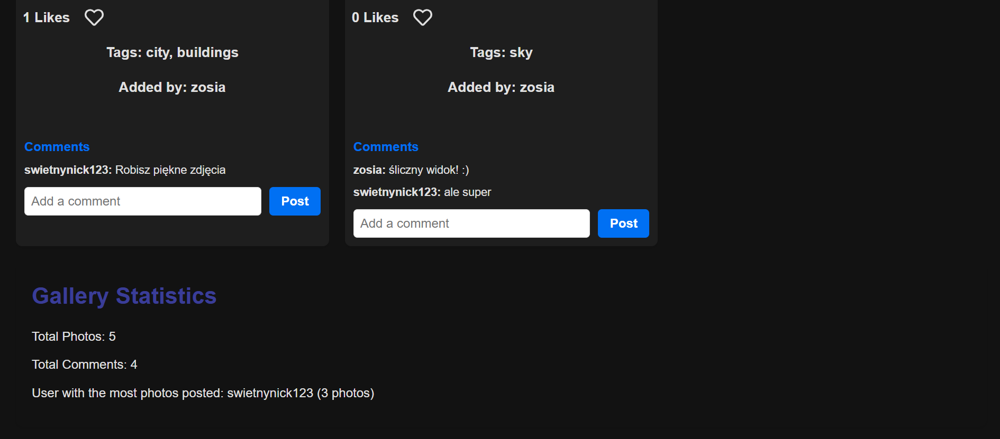

# 📸 **Photographers App** 🎨 

A *web application designed for photographers to **showcase their work**, **manage tasks**, **organize projects** efficiently and help them **develop new ideas**. Built with **Next.js**, **React**, and **MongoDB**, this project provides an intuitive user experience for managing photo galleries, task lists, and projects.

---

## ✨ **Features**

### **Login and Register**
- Register if you don't have an account
- Log in if you already have one

### 📷 **Gallery Management**
- Upload and display stunning photos.
- Like and comment on photos (and delete them if you are the owner).
- Sort photos by likes, comments, and alphabetically.
- Filter photos by inputing the title or a tag.
- Chceck gallery statistics

### 📝 **Task Manager**
- Create, edit, and delete task lists.
- Use predefined templates for quick task management.
- Make your own template which isn't accesible for other users.
- Mark tasks as completed with a single click.

### 🏗️ **Project Organizer**
- Plan projects with deadlines and equipment lists.
- Save project ideas and important details.
- Edit and delete projects with ease.

### **Idea Generator**
- Generate each item (Location, subject, color, theme, challenge)
- Generate all at once
- See a changing sentence at the end which sums up your outcome

### 🎭 **Dark/Light Mode**
- Theme switching using **localStorage**.
- User preference is saved automatically.

---

## 🛠️ **Tech Stack**
- **Frontend:** Next.js, React, CSS
- Formik and Yup for validation
- **State Management:** useContext, useReducer, useMemo, useRef, useCallback
- **Backend:** Node.js, MongoDB

---

## 🚀 **Getting Started**
### **1️⃣ Clone the Repository**
```bash
git clone https://github.com/ahajkowska/Photographers-App.git
cd photographers-app
```

### **2️⃣ Install Dependencies**
```bash
npm install
```

### **3️⃣ Run the Development Server**
```bash
npm run dev
```
Visit **`http://localhost:3000`** in your browser.

---

## 🖼️ **Screenshots**





---
